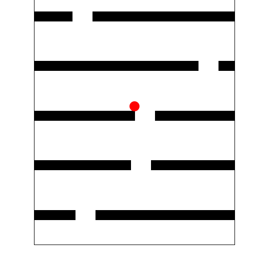

## Game 2: Fall Game

### Description

This is a simple falling game implemented using JavaScript. The game features a character that falls down, and the objective is to navigate the character through gaps in blocks that appear at the top of the screen. The game utilizes the HTML DOM API for manipulating the character and block elements and their styles.

### Technologies Used

- HTML
- CSS
- JavaScript

### Gameplay

- Use the left and right arrow keys to move the character horizontally.
- Navigate the character through the gaps in the blocks to avoid collision.
- The character's falling speed is determined by whether or not it is passing through a gap.
- The game ends when the character collides with a block.

### File Structure

- `index.html`: Contains the game interface and structure.
- `script.js`: Implements the game logic, event listeners, and character/block movement.
- `style.css`: Defines the styles and layout for the game elements.

### How to Run the Game

1. Clone this repository to your local machine.
2. Open the `index.html` file in a web browser.
3. Use the left and right arrow keys to control the character and navigate through the gaps in the blocks.

### Preview

